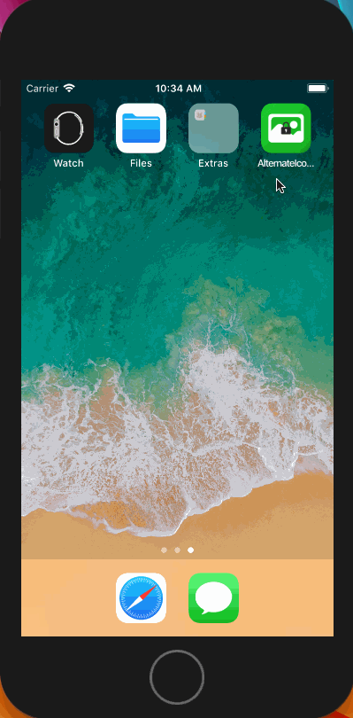
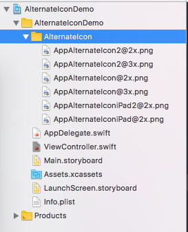

# AlternateIconDemo

[]()
[]()
[]()
[]()

iOS更改App图标


## 环境要求

- iOS10.3+
- Swift4.0
- Xcode9.0+

## 演示



## 说明

苹果在iOS10.3系统中为我们带来了更改App图标的功能， 主要接口定义如下：

```Swift
// Pass `nil` to use the primary application icon. The completion handler will be invoked asynchronously on an arbitrary background queue; be sure to dispatch back to the main queue before doing any further UI work.
@available(iOS 10.3, *)
open func setAlternateIconName(_ alternateIconName: String?, completionHandler: ((Error?) -> Swift.Void)? = nil)
```


在使用该功能前，我们需要注意一下几点：

- iOS10.3或以上系统版本
- 在Info.plist中声明了主图标和备用图标，只能使用声明过的图标，并且iPhone和iPad需要分别声明
- `UIApplication.shared.supportsAlternateIcons`返回true时才能修改图标
- 备用图标不能放在`Assets.xcassets`，必须是直接拖到Xcode左侧的项目导航栏上

#### 下面让我们搞起来吧～～～


###### 1. 把备用图标拖入项目中

看起来应该是这样的



###### 2. 在Info.plist中声明主图标和备用图标

`CFBundleIcons`声明的是iPhone使用的图标，iPad需要使用`CFBundleIcons~ipad`进行声明。

`CFBundlePrimaryIcon`声明的就是我们App的主图标（在iOS11.2模拟器上测试，发现不添加该字段程序也能正常运行），而`CFBundleAlternateIcons`声明的就是我们的备用图标，该字段对应的值是一个字典值，字典下面又是字典:)，你可以通过添加多个字典来添加多个备用图标。

下面的示例中我声明了两个备用图标。

字段含义可参考官方文档: [👇戳这里](https://developer.apple.com/library/content/documentation/General/Reference/InfoPlistKeyReference/Articles/CoreFoundationKeys.html#//apple_ref/doc/uid/TP40009249-SW10)

```
<key>CFBundleIcons</key>
<dict>
    <key>CFBundleAlternateIcons</key>
    <dict>
        <key>AppAlternateIcon</key>
        <dict>
            <key>CFBundleIconFiles</key>
            <array>
                <string>AppAlternateIcon</string>
            </array>
            <key>UIPrerenderedIcon</key>
            <false/>
        </dict>
        <key>AppAlternateIcon2</key>
        <dict>
            <key>CFBundleIconFiles</key>
            <array>
                <string>AppAlternateIcon2</string>
            </array>
            <key>UIPrerenderedIcon</key>
            <false/>
        </dict>
    </dict>
    <key>CFBundlePrimaryIcon</key>
    <dict>
        <key>CFBundleIconFiles</key>
        <array>
            <string>AppIcon60x60</string>
        </array>
    </dict>
</dict>
<key>CFBundleIcons~ipad</key>
<dict>
    <key>CFBundleAlternateIcons</key>
    <dict>
        <key>AppAlternateIconiPad</key>
        <dict>
            <key>CFBundleIconFiles</key>
            <array>
                <string>AppAlternateIconiPad</string>
            </array>
            <key>UIPrerenderedIcon</key>
            <false/>
        </dict>
        <key>AppAlternateIconiPad2</key>
        <dict>
            <key>CFBundleIconFiles</key>
            <array>
                <string>AppAlternateIconiPad2</string>
            </array>
            <key>UIPrerenderedIcon</key>
            <false/>
        </dict>
    </dict>
    <key>CFBundlePrimaryIcon</key>
    <dict>
        <key>CFBundleIconFiles</key>
        <array>
            <string>AppIcon83.5x83.5</string>
        </array>
    </dict>
</dict>
```


###### 3. 万事俱备，现在开始更换图标

直接上代码(点击按钮，然后生成一个随机数，根据随机数获取相应的备用图标)：

```Swift
@IBAction func buttonAction(_ sender: UIButton) {
    if #available(iOS 10.3, *) {
        if !UIApplication.shared.supportsAlternateIcons {
            return
        }
        let random = arc4random_uniform(3)
        let iPad = (UI_USER_INTERFACE_IDIOM() == .pad)
        var iconName: String? // nil表示使用App原来的图标

        if random == 1 { // 图标1
            iconName = iPad ? "AppAlternateIconiPad" : "AppAlternateIcon"
        } else if random == 2 { // 图标2
            iconName = iPad ? "AppAlternateIconiPad2" : "AppAlternateIcon2"
        }
        
        if UIApplication.shared.alternateIconName == iconName {
            // App图标已是当前选中的图标，无需更换
            return
        }
        UIApplication.shared.setAlternateIconName(iconName, completionHandler: nil)
    }
}
```

## 协议

被许可在 MIT 协议下使用。查阅`LICENSE`文件来获得更多信息。
